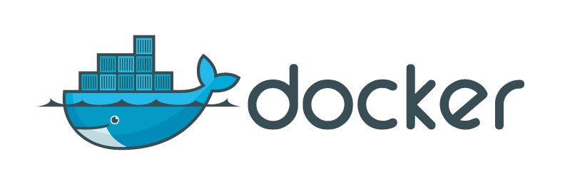
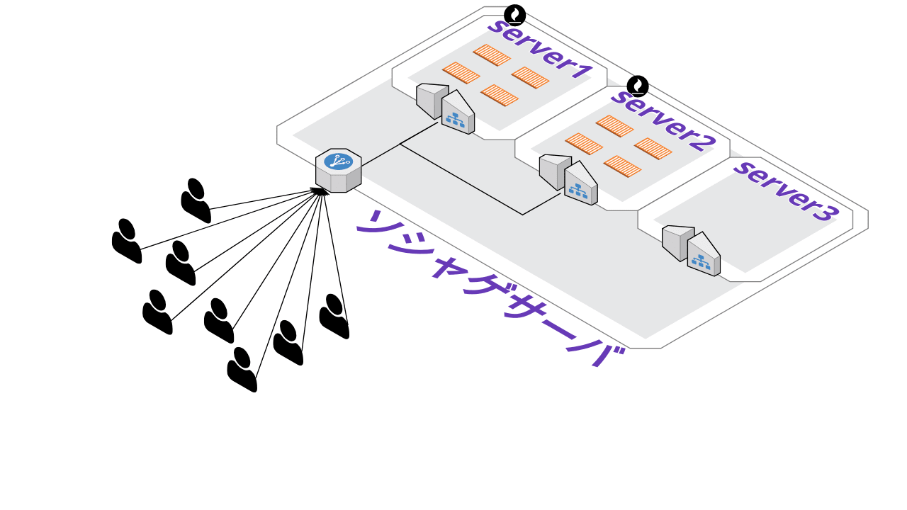
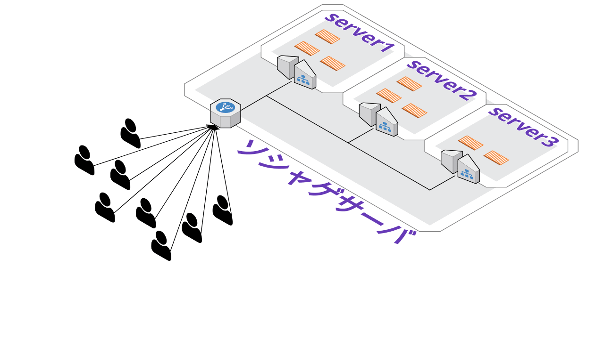

# Docker基礎
## とりあえずwebサーバ立てる
y.okuda  


---

## Dockerってなんぞ
- 仮想環境を提供するツール  
- VMみたいなもん

>>>

# 例
## ALPINE LINUXを立ち上げてみる

>>>

## ALPINE LINUX
   <iframe width="1200px" height="500px" src="http://localhost:8080/">  </iframe>

>>>

## Dockerのイメージ


---

## Dockerの何がいいの？
1. 依存性を排除
1. 高スケーラビリティ
1. 低オーバーヘッド

---

### 1.依存性を排除
必要なライブラリやアプリケーションが詰まったイメージが配布される。

>>>

## こんな経験ないですか?

>>>

### サーバ構築しよう！

>>>

### なんか色々導入

>>>

### なんか色々導入

>>>

### なんか色々設定

>>>

### なんか色々設定

>>>

### ...

>>>

### システム「エラーです。」

>>>

### システム「nodeのバージョンが・・・」

>>>

### システム「pythonのバージョンが・・・」

>>>

### システム「phpのライブラリが・・・」

>>>

# うるせぇ！


>>>

### Dockerを使えば依存性をコンテナ内に閉じ込めることができる
##### Hello Container ,  
##### Goodbye fu&#42;&#42;&#42;n' Dependency Hell.


---

### 2.高スケーラビリティ
コンテナをデプロイするだけで鯖強化

>>>



>>>



---

### 3.低オーバーヘッド
VMに比べて軽くて早い


---

## ALPINE以外のイメージは？  

>>>

* Wordpress
* Ubuntu
* MySQL
* GitLab
* Nginx
* Jenkins 　　　
* Minecraft server etc...  

---

## Docker導入までの流れ
1. ホストOSインストール
1. Dockerのインストール
1. デーモンの起動

>>>

## 1. ホストOSのインストール
Linux　ディストロなら大体なんでもOK  
わかんなければとりあえずUbuntu使っておけばOK　　　　　

>>>

## 2. Dockerのインストール
[](https://docs.docker.com/install/linux/docker-ce/ubuntu/)

>>>

## 3. デーモン起動
```
# systemctl start docker
```

>>>

# 導入完了
これでコンテナ動かせます

---

## コンテナ起動までの流れ
1. ベースになるイメージのダウンロード
1. dockerfile作成(設定ファイル)
1. ビルド
1. 起動

>>>

## 1.ベースになるイメージのダウンロード
## docker pull
```
# docker pull <image name>
```

>>>

## 2.dockerfile作成
* 環境変数
* ファイルのコピー
* 実行コマンド  
などの設定を記述したファイル

>>>

## 3.ビルド
```
# docker build -t <image name> <PathToDockerfile>
```

>>>

## 4.起動

```
# docker run <image name>
```

---

## 例1.Webサーバを立ててみる

>>>

## 1.nginxイメージのダウンロード
```
# docker pull nginx
```
 <iframe width="1200px" height="400px" src="http://localhost:8080/">  </iframe>

>>>

## 2.Dockerfile作成
## 3.ビルド
はちょっと飛ばして

>>>

## 4.とりあえず起動
```
# docker run nginx
```
<iframe width="1200px" height="500px" src="http://localhost:8080/">  </iframe>

>>>

## アタッチしてみる

```
# docker exec -it <container id> bash
```
<iframe width="1200px" height="500px" src="http://localhost:8080/">  </iframe>

>>>

## ちゃんと設定ファイルを作る
```
FROM nginx
ADD ./html /usr/share/nginx/html
EXPOSE 80
CMD ["nginx", "-g", "daemon off;"]

```
<iframe width="1200px" height="400px" src="http://localhost:8080/">  </iframe>


>>>

### ちゃんとビルド & 起動

```
# docker build -t <your image name> <pathToDockerfile>
# docker run　　 -p <host port>:<container port> <image name>
```
<iframe width="1200px" height="500px" src="http://localhost:8080/">  </iframe>

>>>

# つないでみる

---

## 例2.Jupyter notebook

>>>

## Jupyter notebookとは
#### ブラウザを介してPython/Rを使える素敵ツール  
* 良さげなライブラリが最初から入ってる
* ややこしい設定が不要
* とりあえずpullしてrunすれば動く  

>>>

## 動かしてみる

```
# docker pull jupyter/datascience-notebook
# docker run　　 -p 8888:8888 jupyter/datascience-notebook
```
<iframe width="1200px" height="500px" src="http://localhost:8080/">  </iframe>

---


## 例3.PowerShell

>>>

## PowerShell
* オープンソース、クロスプラットフォームの素敵なシェル
* パイプには文字じゃなくてオブジェクトが流れる

>>>

## 動かしてみる

```
# docker pull mcr.microsoft.com/powershell
# docker run　　 -it mcr.microsoft.com/powershell
```
<iframe width="1200px" height="500px" src="http://localhost:8080/">  </iframe>

---


## コマンド
```
# ###イメージをダウンロード
# docker pull <image name>
# 
# ###ビルド
# docker build -t <your image name> <pathToDockerfile>
# 
# ###起動
# docker run -p <Host port>:<Container port> <image name>
#
# ###アタッチ
# docker exec -it <container id> bash
#
# ###起動コンテナ一覧
# docker ps
#
# ###保有イメージ一覧
# docker images
#
# ###コンテナ停止
# docker stop <container id>
```


---

# まとめ
## Build, Ship, and Run Any App, Anywhere

---

# 補足
* スライド : reveal.js
* ターミナル : tty.js (nodejs)
* 図 : Cloud Craft


