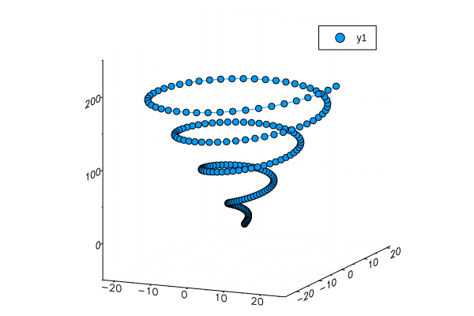

xrandr --output HDMI-1 --auto


# KaggleのTitanicをやり始めるまでの話

### Kaggle
データ分析コンペのプラットフォーム
### Titanic
Kaggleのチュートリアル的なコンペ

## 技術書典で本を買いました
* PythonによるKaggleのチュートリアル


 ## ところで・・・
 最近Juliaという言語が気になってます。

## ということで
KaggleとJuliaに同時に入門しました。

## 目次
1. Juliaとは
1. 環境
1. Kaggleとは
1. Titanicとは
1. Titanicを解いてみる

# Juliaとは

## Julia言語の特徴
* 速い
* Python資産を利用可能
* データの可視化が容易


```julia
print("Hello　World")
```

    Hello　World

## どのぐらい速いか
fib(n)をPython, R, Juliaで比較してみた  
[Python](http://localhost:8888/notebooks/work/fib_py.ipynb)
```Python
def fib(n):
    return 1 if n<=1 else fib(n-2) + fib(n-1)
```

[R](http://localhost:8888/notebooks/work/fib_r.ipynb)
```R
fib <- function(n)ifelse(n<=1,1,fib(n-2)+fib(n-1))
```

[Julia](http://localhost:8888/notebooks/work/fib_jl.ipynb)
```Julia
fib(n) = n<=1 ? 1 : fib(n-2)+fib(n-1)
```


## 結果


```julia
using CSV
using Plots
using GR
gr()
```


    Plots.GRBackend()


```julia
score = CSV.read("./fib_score.csv")
Plots.plot([score.R[1:30],score.Python[1:35],score.Julia[1:40]],label=["R" "Python" "Julia"],lw=5)
```


## Pythonライブラリの利用方法
* PyCallを利用


```julia
using Plots
using GR
gr()
```


    Plots.GRBackend()


```julia
using PyCall
@pyimport math
Plots.plot(math.cos.((1:100)/10))
```


## 簡単にデータを可視化できる


```julia
using Plots
using GR
gr()
```


    Plots.GRBackend()


```julia
N = 200
d = 8π/N
x = [d*n*cos(d*n) for n in 0:N]
y = [d*n*sin(d*n) for n in 0:N]
z = 0.0:N
Plots.plot(x,y,z,marker=:circle)
```





## こんなこともできる


```julia
mutable struct Lorenz
    dt; σ; ρ; β; x; y; z
end
function step!(l::Lorenz)
    dx = l.σ*(l.y - l.x)       ; l.x += l.dt * dx
    dy = l.x*(l.ρ - l.z) - l.y ; l.y += l.dt * dy
    dz = l.x*l.y - l.β*l.z     ; l.z += l.dt * dz
end
attractor = Lorenz((dt = 0.02, σ = 10., ρ = 28., β = 8//3, x = 1., y = 1., z = 1.)...)
plt = plot3d(1, xlim=(-25,25), ylim=(-25,25), zlim=(0,50),
                title = "Lorenz Attractor", marker = 2)
@gif for i=1:1500
    step!(attractor)
    push!(plt, attractor.x, attractor.y, attractor.z)
end every 10
```

    ┌ Info: Saved animation to 
    │   fn = /home/jovyan/work/tmp.gif
    └ @ Plots /opt/julia/packages/Plots/qh1wV/src/animation.jl:90


" />


# 環境

## 環境
* JupyterNotebook(Docker)
* RISE

## 1.Dockerfile作成
JupyterNotebookでRISEを使うためにDockerfileを作成
```yml
FROM jupyter/datascience-notebook
RUN pip install RISE 
RUN jupyter-nbextension install rise --py --sys-prefix
RUN jupyter-nbextension enable rise --py --sys-prefix
EXPOSE 8888
```

## 2.docker-compose.yml作成
ライブラリがインストールされるディレクトリはホストにマウント。
```
version:  '3'
services:
  datascience-notebook:
      image: myjupyter
      volumes:
        - ./data/work:/home/jovyan/work
        - ./data/notebook:/etc/ssl/notebook
        - ./data/julia_module:/opt/julia
      ports:
        - 8888:8888
      container_name:   jupyter_notebook
      command: "start-notebook.sh \
        --NotebookApp.password='sha1:f09a03d5998b:7366bffeb720c8e67e821b9e1fbb0a754f1e4476'"
```


## 3.起動
```shell
docker-compose up
```

## 4.ライブラリ導入
jupyternotebookの機能からTerminalにアクセス可能。  
そこから導入すればOK

# Kaggleとは

## Kaggleとは
* データ分析コンペのプラットフォーム
* 企業がデータを提供する
* 誰が最も正確な予測ができるか競う
* 賞金あり


## 参加したいコンペを選択して参加


## コンペに関して多数のDiscussionが開かれます


## 人のコードが見れます


# Titanicとは

## Titanicとは
* Kaggleのチュートリアル的な問題
* Titanic乗客の生死を予測する

## Titanicの詳細
次の２つのデータが提供される
* train.csv
* test.csv

### train.csv
891人分の乗客情報と生死のペア


```julia
using CSV
titanic=CSV.read("./train.csv")
```


<table class="data-frame"><thead><tr><th></th><th>PassengerId</th><th>Survived</th><th>Pclass</th><th>Name</th><th>Sex</th><th>Age</th><th>SibSp</th><th>Parch</th><th>Ticket</th><th>Fare</th><th>Cabin</th><th>Embarked</th></tr><tr><th></th><th>Int64⍰</th><th>Int64⍰</th><th>Int64⍰</th><th>String⍰</th><th>String⍰</th><th>Float64⍰</th><th>Int64⍰</th><th>Int64⍰</th><th>String⍰</th><th>Float64⍰</th><th>String⍰</th><th>String⍰</th></tr></thead><tbody><p>891 rows × 12 columns</p><tr><th>1</th><td>1</td><td>0</td><td>3</td><td>Braund, Mr. Owen Harris</td><td>male</td><td>22.0</td><td>1</td><td>0</td><td>A/5 21171</td><td>7.25</td><td>missing</td><td>S</td></tr><tr><th>2</th><td>2</td><td>1</td><td>1</td><td>Cumings, Mrs. John Bradley (Florence Briggs Thayer)</td><td>female</td><td>38.0</td><td>1</td><td>0</td><td>PC 17599</td><td>71.2833</td><td>C85</td><td>C</td></tr><tr><th>3</th><td>3</td><td>1</td><td>3</td><td>Heikkinen, Miss. Laina</td><td>female</td><td>26.0</td><td>0</td><td>0</td><td>STON/O2. 3101282</td><td>7.925</td><td>missing</td><td>S</td></tr><tr><th>4</th><td>4</td><td>1</td><td>1</td><td>Futrelle, Mrs. Jacques Heath (Lily May Peel)</td><td>female</td><td>35.0</td><td>1</td><td>0</td><td>113803</td><td>53.1</td><td>C123</td><td>S</td></tr><tr><th>5</th><td>5</td><td>0</td><td>3</td><td>Allen, Mr. William Henry</td><td>male</td><td>35.0</td><td>0</td><td>0</td><td>373450</td><td>8.05</td><td>missing</td><td>S</td></tr><tr><th>6</th><td>6</td><td>0</td><td>3</td><td>Moran, Mr. James</td><td>male</td><td>missing</td><td>0</td><td>0</td><td>330877</td><td>8.4583</td><td>missing</td><td>Q</td></tr><tr><th>7</th><td>7</td><td>0</td><td>1</td><td>McCarthy, Mr. Timothy J</td><td>male</td><td>54.0</td><td>0</td><td>0</td><td>17463</td><td>51.8625</td><td>E46</td><td>S</td></tr><tr><th>8</th><td>8</td><td>0</td><td>3</td><td>Palsson, Master. Gosta Leonard</td><td>male</td><td>2.0</td><td>3</td><td>1</td><td>349909</td><td>21.075</td><td>missing</td><td>S</td></tr><tr><th>9</th><td>9</td><td>1</td><td>3</td><td>Johnson, Mrs. Oscar W (Elisabeth Vilhelmina Berg)</td><td>female</td><td>27.0</td><td>0</td><td>2</td><td>347742</td><td>11.1333</td><td>missing</td><td>S</td></tr><tr><th>10</th><td>10</td><td>1</td><td>2</td><td>Nasser, Mrs. Nicholas (Adele Achem)</td><td>female</td><td>14.0</td><td>1</td><td>0</td><td>237736</td><td>30.0708</td><td>missing</td><td>C</td></tr><tr><th>11</th><td>11</td><td>1</td><td>3</td><td>Sandstrom, Miss. Marguerite Rut</td><td>female</td><td>4.0</td><td>1</td><td>1</td><td>PP 9549</td><td>16.7</td><td>G6</td><td>S</td></tr><tr><th>12</th><td>12</td><td>1</td><td>1</td><td>Bonnell, Miss. Elizabeth</td><td>female</td><td>58.0</td><td>0</td><td>0</td><td>113783</td><td>26.55</td><td>C103</td><td>S</td></tr><tr><th>13</th><td>13</td><td>0</td><td>3</td><td>Saundercock, Mr. William Henry</td><td>male</td><td>20.0</td><td>0</td><td>0</td><td>A/5. 2151</td><td>8.05</td><td>missing</td><td>S</td></tr><tr><th>14</th><td>14</td><td>0</td><td>3</td><td>Andersson, Mr. Anders Johan</td><td>male</td><td>39.0</td><td>1</td><td>5</td><td>347082</td><td>31.275</td><td>missing</td><td>S</td></tr><tr><th>15</th><td>15</td><td>0</td><td>3</td><td>Vestrom, Miss. Hulda Amanda Adolfina</td><td>female</td><td>14.0</td><td>0</td><td>0</td><td>350406</td><td>7.8542</td><td>missing</td><td>S</td></tr><tr><th>16</th><td>16</td><td>1</td><td>2</td><td>Hewlett, Mrs. (Mary D Kingcome) </td><td>female</td><td>55.0</td><td>0</td><td>0</td><td>248706</td><td>16.0</td><td>missing</td><td>S</td></tr><tr><th>17</th><td>17</td><td>0</td><td>3</td><td>Rice, Master. Eugene</td><td>male</td><td>2.0</td><td>4</td><td>1</td><td>382652</td><td>29.125</td><td>missing</td><td>Q</td></tr><tr><th>18</th><td>18</td><td>1</td><td>2</td><td>Williams, Mr. Charles Eugene</td><td>male</td><td>missing</td><td>0</td><td>0</td><td>244373</td><td>13.0</td><td>missing</td><td>S</td></tr><tr><th>19</th><td>19</td><td>0</td><td>3</td><td>Vander Planke, Mrs. Julius (Emelia Maria Vandemoortele)</td><td>female</td><td>31.0</td><td>1</td><td>0</td><td>345763</td><td>18.0</td><td>missing</td><td>S</td></tr><tr><th>20</th><td>20</td><td>1</td><td>3</td><td>Masselmani, Mrs. Fatima</td><td>female</td><td>missing</td><td>0</td><td>0</td><td>2649</td><td>7.225</td><td>missing</td><td>C</td></tr><tr><th>21</th><td>21</td><td>0</td><td>2</td><td>Fynney, Mr. Joseph J</td><td>male</td><td>35.0</td><td>0</td><td>0</td><td>239865</td><td>26.0</td><td>missing</td><td>S</td></tr><tr><th>22</th><td>22</td><td>1</td><td>2</td><td>Beesley, Mr. Lawrence</td><td>male</td><td>34.0</td><td>0</td><td>0</td><td>248698</td><td>13.0</td><td>D56</td><td>S</td></tr><tr><th>23</th><td>23</td><td>1</td><td>3</td><td>McGowan, Miss. Anna "Annie"</td><td>female</td><td>15.0</td><td>0</td><td>0</td><td>330923</td><td>8.0292</td><td>missing</td><td>Q</td></tr><tr><th>24</th><td>24</td><td>1</td><td>1</td><td>Sloper, Mr. William Thompson</td><td>male</td><td>28.0</td><td>0</td><td>0</td><td>113788</td><td>35.5</td><td>A6</td><td>S</td></tr><tr><th>25</th><td>25</td><td>0</td><td>3</td><td>Palsson, Miss. Torborg Danira</td><td>female</td><td>8.0</td><td>3</td><td>1</td><td>349909</td><td>21.075</td><td>missing</td><td>S</td></tr><tr><th>26</th><td>26</td><td>1</td><td>3</td><td>Asplund, Mrs. Carl Oscar (Selma Augusta Emilia Johansson)</td><td>female</td><td>38.0</td><td>1</td><td>5</td><td>347077</td><td>31.3875</td><td>missing</td><td>S</td></tr><tr><th>27</th><td>27</td><td>0</td><td>3</td><td>Emir, Mr. Farred Chehab</td><td>male</td><td>missing</td><td>0</td><td>0</td><td>2631</td><td>7.225</td><td>missing</td><td>C</td></tr><tr><th>28</th><td>28</td><td>0</td><td>1</td><td>Fortune, Mr. Charles Alexander</td><td>male</td><td>19.0</td><td>3</td><td>2</td><td>19950</td><td>263.0</td><td>C23 C25 C27</td><td>S</td></tr><tr><th>29</th><td>29</td><td>1</td><td>3</td><td>O'Dwyer, Miss. Ellen "Nellie"</td><td>female</td><td>missing</td><td>0</td><td>0</td><td>330959</td><td>7.8792</td><td>missing</td><td>Q</td></tr><tr><th>30</th><td>30</td><td>0</td><td>3</td><td>Todoroff, Mr. Lalio</td><td>male</td><td>missing</td><td>0</td><td>0</td><td>349216</td><td>7.8958</td><td>missing</td><td>S</td></tr><tr><th>&vellip;</th><td>&vellip;</td><td>&vellip;</td><td>&vellip;</td><td>&vellip;</td><td>&vellip;</td><td>&vellip;</td><td>&vellip;</td><td>&vellip;</td><td>&vellip;</td><td>&vellip;</td><td>&vellip;</td><td>&vellip;</td></tr></tbody></table>


### test.csv
418人分の乗客情報（生死を除く）  
この418人の生死を予測し、その制度を競う


```julia
using CSV
test=CSV.read("./test.csv")
```


<table class="data-frame"><thead><tr><th></th><th>PassengerId</th><th>Pclass</th><th>Name</th><th>Sex</th><th>Age</th><th>SibSp</th><th>Parch</th><th>Ticket</th><th>Fare</th><th>Cabin</th><th>Embarked</th></tr><tr><th></th><th>Int64⍰</th><th>Int64⍰</th><th>String⍰</th><th>String⍰</th><th>Float64⍰</th><th>Int64⍰</th><th>Int64⍰</th><th>String⍰</th><th>Float64⍰</th><th>String⍰</th><th>String⍰</th></tr></thead><tbody><p>418 rows × 11 columns</p><tr><th>1</th><td>892</td><td>3</td><td>Kelly, Mr. James</td><td>male</td><td>34.5</td><td>0</td><td>0</td><td>330911</td><td>7.8292</td><td>missing</td><td>Q</td></tr><tr><th>2</th><td>893</td><td>3</td><td>Wilkes, Mrs. James (Ellen Needs)</td><td>female</td><td>47.0</td><td>1</td><td>0</td><td>363272</td><td>7.0</td><td>missing</td><td>S</td></tr><tr><th>3</th><td>894</td><td>2</td><td>Myles, Mr. Thomas Francis</td><td>male</td><td>62.0</td><td>0</td><td>0</td><td>240276</td><td>9.6875</td><td>missing</td><td>Q</td></tr><tr><th>4</th><td>895</td><td>3</td><td>Wirz, Mr. Albert</td><td>male</td><td>27.0</td><td>0</td><td>0</td><td>315154</td><td>8.6625</td><td>missing</td><td>S</td></tr><tr><th>5</th><td>896</td><td>3</td><td>Hirvonen, Mrs. Alexander (Helga E Lindqvist)</td><td>female</td><td>22.0</td><td>1</td><td>1</td><td>3101298</td><td>12.2875</td><td>missing</td><td>S</td></tr><tr><th>6</th><td>897</td><td>3</td><td>Svensson, Mr. Johan Cervin</td><td>male</td><td>14.0</td><td>0</td><td>0</td><td>7538</td><td>9.225</td><td>missing</td><td>S</td></tr><tr><th>7</th><td>898</td><td>3</td><td>Connolly, Miss. Kate</td><td>female</td><td>30.0</td><td>0</td><td>0</td><td>330972</td><td>7.6292</td><td>missing</td><td>Q</td></tr><tr><th>8</th><td>899</td><td>2</td><td>Caldwell, Mr. Albert Francis</td><td>male</td><td>26.0</td><td>1</td><td>1</td><td>248738</td><td>29.0</td><td>missing</td><td>S</td></tr><tr><th>9</th><td>900</td><td>3</td><td>Abrahim, Mrs. Joseph (Sophie Halaut Easu)</td><td>female</td><td>18.0</td><td>0</td><td>0</td><td>2657</td><td>7.2292</td><td>missing</td><td>C</td></tr><tr><th>10</th><td>901</td><td>3</td><td>Davies, Mr. John Samuel</td><td>male</td><td>21.0</td><td>2</td><td>0</td><td>A/4 48871</td><td>24.15</td><td>missing</td><td>S</td></tr><tr><th>11</th><td>902</td><td>3</td><td>Ilieff, Mr. Ylio</td><td>male</td><td>missing</td><td>0</td><td>0</td><td>349220</td><td>7.8958</td><td>missing</td><td>S</td></tr><tr><th>12</th><td>903</td><td>1</td><td>Jones, Mr. Charles Cresson</td><td>male</td><td>46.0</td><td>0</td><td>0</td><td>694</td><td>26.0</td><td>missing</td><td>S</td></tr><tr><th>13</th><td>904</td><td>1</td><td>Snyder, Mrs. John Pillsbury (Nelle Stevenson)</td><td>female</td><td>23.0</td><td>1</td><td>0</td><td>21228</td><td>82.2667</td><td>B45</td><td>S</td></tr><tr><th>14</th><td>905</td><td>2</td><td>Howard, Mr. Benjamin</td><td>male</td><td>63.0</td><td>1</td><td>0</td><td>24065</td><td>26.0</td><td>missing</td><td>S</td></tr><tr><th>15</th><td>906</td><td>1</td><td>Chaffee, Mrs. Herbert Fuller (Carrie Constance Toogood)</td><td>female</td><td>47.0</td><td>1</td><td>0</td><td>W.E.P. 5734</td><td>61.175</td><td>E31</td><td>S</td></tr><tr><th>16</th><td>907</td><td>2</td><td>del Carlo, Mrs. Sebastiano (Argenia Genovesi)</td><td>female</td><td>24.0</td><td>1</td><td>0</td><td>SC/PARIS 2167</td><td>27.7208</td><td>missing</td><td>C</td></tr><tr><th>17</th><td>908</td><td>2</td><td>Keane, Mr. Daniel</td><td>male</td><td>35.0</td><td>0</td><td>0</td><td>233734</td><td>12.35</td><td>missing</td><td>Q</td></tr><tr><th>18</th><td>909</td><td>3</td><td>Assaf, Mr. Gerios</td><td>male</td><td>21.0</td><td>0</td><td>0</td><td>2692</td><td>7.225</td><td>missing</td><td>C</td></tr><tr><th>19</th><td>910</td><td>3</td><td>Ilmakangas, Miss. Ida Livija</td><td>female</td><td>27.0</td><td>1</td><td>0</td><td>STON/O2. 3101270</td><td>7.925</td><td>missing</td><td>S</td></tr><tr><th>20</th><td>911</td><td>3</td><td>Assaf Khalil, Mrs. Mariana (Miriam")"</td><td>female</td><td>45.0</td><td>0</td><td>0</td><td>2696</td><td>7.225</td><td>missing</td><td>C</td></tr><tr><th>21</th><td>912</td><td>1</td><td>Rothschild, Mr. Martin</td><td>male</td><td>55.0</td><td>1</td><td>0</td><td>PC 17603</td><td>59.4</td><td>missing</td><td>C</td></tr><tr><th>22</th><td>913</td><td>3</td><td>Olsen, Master. Artur Karl</td><td>male</td><td>9.0</td><td>0</td><td>1</td><td>C 17368</td><td>3.1708</td><td>missing</td><td>S</td></tr><tr><th>23</th><td>914</td><td>1</td><td>Flegenheim, Mrs. Alfred (Antoinette)</td><td>female</td><td>missing</td><td>0</td><td>0</td><td>PC 17598</td><td>31.6833</td><td>missing</td><td>S</td></tr><tr><th>24</th><td>915</td><td>1</td><td>Williams, Mr. Richard Norris II</td><td>male</td><td>21.0</td><td>0</td><td>1</td><td>PC 17597</td><td>61.3792</td><td>missing</td><td>C</td></tr><tr><th>25</th><td>916</td><td>1</td><td>Ryerson, Mrs. Arthur Larned (Emily Maria Borie)</td><td>female</td><td>48.0</td><td>1</td><td>3</td><td>PC 17608</td><td>262.375</td><td>B57 B59 B63 B66</td><td>C</td></tr><tr><th>26</th><td>917</td><td>3</td><td>Robins, Mr. Alexander A</td><td>male</td><td>50.0</td><td>1</td><td>0</td><td>A/5. 3337</td><td>14.5</td><td>missing</td><td>S</td></tr><tr><th>27</th><td>918</td><td>1</td><td>Ostby, Miss. Helene Ragnhild</td><td>female</td><td>22.0</td><td>0</td><td>1</td><td>113509</td><td>61.9792</td><td>B36</td><td>C</td></tr><tr><th>28</th><td>919</td><td>3</td><td>Daher, Mr. Shedid</td><td>male</td><td>22.5</td><td>0</td><td>0</td><td>2698</td><td>7.225</td><td>missing</td><td>C</td></tr><tr><th>29</th><td>920</td><td>1</td><td>Brady, Mr. John Bertram</td><td>male</td><td>41.0</td><td>0</td><td>0</td><td>113054</td><td>30.5</td><td>A21</td><td>S</td></tr><tr><th>30</th><td>921</td><td>3</td><td>Samaan, Mr. Elias</td><td>male</td><td>missing</td><td>2</td><td>0</td><td>2662</td><td>21.6792</td><td>missing</td><td>C</td></tr><tr><th>&vellip;</th><td>&vellip;</td><td>&vellip;</td><td>&vellip;</td><td>&vellip;</td><td>&vellip;</td><td>&vellip;</td><td>&vellip;</td><td>&vellip;</td><td>&vellip;</td><td>&vellip;</td><td>&vellip;</td></tr></tbody></table>


## 乗客情報(CSVのカラム)
* PassengerId : ID
* Survived : 生死
* Pclass : チケットクラス
* Name : 名前
* Sex : 性別
* Age : 年齢
* SibSp : 同乗した兄弟または配偶者の人数
* Parch : 同乗した親または子供の人数
* Ticket : チケット番号
* Fare : 運賃
* Cabin : キャビン番号
* Embarked : 乗船港

# Titanicを解いてみる

# まずは軽く分析...
## とりあえず平均生存率


```julia
using CSV
titanic = CSV.read("./train.csv")
function survive_rate(x)
    dead = sum(x .== 0)
    alive = sum(x .== 1)
    return alive/(dead + alive)
end
survive_rate(titanic.Survived)
```


    0.3838383838383838


## 38%

## 性別
救命ボートには女性が優先的に乗ったことは有名な話。  
男女別で生存率を分析してみる。


```julia
using CSV
titanic = CSV.read("./train.csv")
function survive_rate(x)
    dead = sum(x .== 0)
    alive = sum(x .== 1)
    return alive/(dead + alive)
end
    
CSV.by(titanic,:Sex,:Survived=>sum,:Survived=>x->sum(x.==0),:Survived => survive_rate)
```


<table class="data-frame"><thead><tr><th></th><th>Sex</th><th>Survived_sum</th><th>Survived_function</th><th>Survived_survive_rate</th></tr><tr><th></th><th>String⍰</th><th>Int64</th><th>Int64</th><th>Float64</th></tr></thead><tbody><p>2 rows × 4 columns</p><tr><th>1</th><td>male</td><td>109</td><td>468</td><td>0.188908</td></tr><tr><th>2</th><td>female</td><td>233</td><td>81</td><td>0.742038</td></tr></tbody></table>


## 生存率 男19% 女74%

## 年齢


```julia
titanic_age=titanic[.!ismissing.(titanic.Age),:]
survive_rate(titanic_age[titanic_age.Age.<=15,:].Survived) # under 15 y/o
```


    0.5903614457831325


## 15歳以下の生存率 59%

## チケットクラス
チケットクラスで死亡率を比較してみる。


```julia
CSV.by(titanic,:Pclass,:Survived=>sum,:Survived=>x->sum(x.==0),:Survived => survive_rate)
```


<table class="data-frame"><thead><tr><th></th><th>Pclass</th><th>Survived_sum</th><th>Survived_function</th><th>Survived_survive_rate</th></tr><tr><th></th><th>Int64⍰</th><th>Int64</th><th>Int64</th><th>Float64</th></tr></thead><tbody><p>3 rows × 4 columns</p><tr><th>1</th><td>3</td><td>119</td><td>372</td><td>0.242363</td></tr><tr><th>2</th><td>1</td><td>136</td><td>80</td><td>0.62963</td></tr><tr><th>3</th><td>2</td><td>87</td><td>97</td><td>0.472826</td></tr></tbody></table>


## 1stクラス63% 2ndクラス47% 3rdクラス24%

## 乗船した港
* S : サウサンプトン
* C : シェルブール
* Q : クイーンズタウン(コーヴ)


```julia
CSV.by(titanic,:Embarked,:Survived=>sum,:Survived=>x->sum(x.==0),:Survived => survive_rate)
```


<table class="data-frame"><thead><tr><th></th><th>Embarked</th><th>Survived_sum</th><th>Survived_function</th><th>Survived_survive_rate</th></tr><tr><th></th><th>String⍰</th><th>Int64</th><th>Int64</th><th>Float64</th></tr></thead><tbody><p>4 rows × 4 columns</p><tr><th>1</th><td>S</td><td>217</td><td>427</td><td>0.336957</td></tr><tr><th>2</th><td>C</td><td>93</td><td>75</td><td>0.553571</td></tr><tr><th>3</th><td>Q</td><td>30</td><td>47</td><td>0.38961</td></tr><tr><th>4</th><td>missing</td><td>2</td><td>0</td><td>1.0</td></tr></tbody></table>


## 何故かシェルブールから乗船した人の生存率が高い (55%)

## 色々調べた結果・・・
* 男性死亡率が19% 女性死亡率が74%
* つまり男性死亡、女性生存にしておけばだいたい77%ぐらいいける計算


```julia
test = CSV.read("./test.csv")
test[ismissing.(test.Sex),:Sex]="male"
test.Survived=0
test[test.Sex.=="female",:Survived]=1

survive_rate(test.Survived)
CSV.write("./out9.csv",test[[:PassengerId ,:Survived]])
test[[:PassengerId ,:Survived]]
```


<table class="data-frame"><thead><tr><th></th><th>PassengerId</th><th>Survived</th></tr><tr><th></th><th>Int64⍰</th><th>Int64</th></tr></thead><tbody><p>418 rows × 2 columns</p><tr><th>1</th><td>892</td><td>0</td></tr><tr><th>2</th><td>893</td><td>1</td></tr><tr><th>3</th><td>894</td><td>0</td></tr><tr><th>4</th><td>895</td><td>0</td></tr><tr><th>5</th><td>896</td><td>1</td></tr><tr><th>6</th><td>897</td><td>0</td></tr><tr><th>7</th><td>898</td><td>1</td></tr><tr><th>8</th><td>899</td><td>0</td></tr><tr><th>9</th><td>900</td><td>1</td></tr><tr><th>10</th><td>901</td><td>0</td></tr><tr><th>11</th><td>902</td><td>0</td></tr><tr><th>12</th><td>903</td><td>0</td></tr><tr><th>13</th><td>904</td><td>1</td></tr><tr><th>14</th><td>905</td><td>0</td></tr><tr><th>15</th><td>906</td><td>1</td></tr><tr><th>16</th><td>907</td><td>1</td></tr><tr><th>17</th><td>908</td><td>0</td></tr><tr><th>18</th><td>909</td><td>0</td></tr><tr><th>19</th><td>910</td><td>1</td></tr><tr><th>20</th><td>911</td><td>1</td></tr><tr><th>21</th><td>912</td><td>0</td></tr><tr><th>22</th><td>913</td><td>0</td></tr><tr><th>23</th><td>914</td><td>1</td></tr><tr><th>24</th><td>915</td><td>0</td></tr><tr><th>25</th><td>916</td><td>1</td></tr><tr><th>26</th><td>917</td><td>0</td></tr><tr><th>27</th><td>918</td><td>1</td></tr><tr><th>28</th><td>919</td><td>0</td></tr><tr><th>29</th><td>920</td><td>0</td></tr><tr><th>30</th><td>921</td><td>0</td></tr><tr><th>&vellip;</th><td>&vellip;</td><td>&vellip;</td></tr></tbody></table>


# submit結果
### 76%


# 最後に機械学習っぽいことを少し


```julia
using CSV
using PyCall
@pyimport catboost
train_df = CSV.read("./train.csv")
test_df = CSV.read("./test.csv")

# missing -> -999
train_df[ismissing.(train_df.Age),:Age]=-999
train_df[ismissing.(train_df.Cabin),:Cabin]= "-999"
train_df[ismissing.(train_df.Embarked),:Embarked]="-999"
train_labels=train_df.Survived
delete!(train_df,:Survived)

#missing -> -999
test_df[ismissing.(test_df.Age),:Age]=-999
test_df[ismissing.(test_df.Cabin),:Cabin]= "-999"
test_df[ismissing.(test_df.Embarked),:Embarked]="-999"
test_df[ismissing.(test_df.Fare),:Fare]=50

#define model
model = catboost.CatBoostClassifier(iterations=300, learning_rate=0.3, depth=3, loss_function="Logloss")

# Learnning!
model["fit"](convert(Matrix,train_df), train_labels, cat_features=[2,3,7,9,10])
preds_class = model["predict"](convert(Matrix,test_df))
test_df.Survived=0
test_df.Survived.=preds_class
CSV.write("./out11.csv",test_df[[:PassengerId ,:Survived]])
```

    ┌ Warning: `delete!(df::AbstractDataFrame, cols::Any)` is deprecated, use `deletecols!(df, cols)` instead.
    │   caller = top-level scope at In[15]:12
    └ @ Core In[15]:12


    0:	learn: 0.5514416	total: 70.1ms	remaining: 21s
    1:	learn: 0.5007026	total: 83.5ms	remaining: 12.4s
    2:	learn: 0.4742543	total: 94.8ms	remaining: 9.38s
    3:	learn: 0.4637403	total: 106ms	remaining: 7.86s
    4:	learn: 0.4592788	total: 121ms	remaining: 7.15s
    5:	learn: 0.4533010	total: 137ms	remaining: 6.71s
    6:	learn: 0.4431426	total: 153ms	remaining: 6.41s
    7:	learn: 0.4286018	total: 164ms	remaining: 5.99s
    8:	learn: 0.4272226	total: 176ms	remaining: 5.68s
    9:	learn: 0.4216128	total: 187ms	remaining: 5.43s
    10:	learn: 0.4177113	total: 199ms	remaining: 5.22s
    11:	learn: 0.4158312	total: 209ms	remaining: 5.01s
    12:	learn: 0.4124104	total: 221ms	remaining: 4.88s
    13:	learn: 0.4100723	total: 235ms	remaining: 4.81s
    14:	learn: 0.4080437	total: 250ms	remaining: 4.75s
    15:	learn: 0.4068036	total: 262ms	remaining: 4.65s
    16:	learn: 0.4062323	total: 272ms	remaining: 4.53s
    17:	learn: 0.4050024	total: 283ms	remaining: 4.43s
    18:	learn: 0.4031259	total: 294ms	remaining: 4.35s
    19:	learn: 0.4028348	total: 306ms	remaining: 4.28s
    20:	learn: 0.4022448	total: 318ms	remaining: 4.23s
    21:	learn: 0.4022357	total: 331ms	remaining: 4.18s
    22:	learn: 0.3993393	total: 342ms	remaining: 4.12s
    23:	learn: 0.3973265	total: 354ms	remaining: 4.07s
    24:	learn: 0.3967000	total: 365ms	remaining: 4.02s
    25:	learn: 0.3957914	total: 377ms	remaining: 3.97s
    26:	learn: 0.3948713	total: 389ms	remaining: 3.93s
    27:	learn: 0.3892758	total: 402ms	remaining: 3.9s
    28:	learn: 0.3890406	total: 415ms	remaining: 3.87s
    29:	learn: 0.3889354	total: 426ms	remaining: 3.83s
    30:	learn: 0.3871418	total: 437ms	remaining: 3.79s
    31:	learn: 0.3842256	total: 448ms	remaining: 3.75s
    32:	learn: 0.3816093	total: 459ms	remaining: 3.71s
    33:	learn: 0.3799342	total: 470ms	remaining: 3.68s
    34:	learn: 0.3793016	total: 482ms	remaining: 3.65s
    35:	learn: 0.3788080	total: 494ms	remaining: 3.62s
    36:	learn: 0.3782498	total: 507ms	remaining: 3.6s
    37:	learn: 0.3774620	total: 518ms	remaining: 3.57s
    38:	learn: 0.3770295	total: 529ms	remaining: 3.54s
    39:	learn: 0.3761204	total: 540ms	remaining: 3.51s
    40:	learn: 0.3757096	total: 551ms	remaining: 3.48s
    41:	learn: 0.3755372	total: 563ms	remaining: 3.46s
    42:	learn: 0.3740368	total: 576ms	remaining: 3.44s
    43:	learn: 0.3739120	total: 587ms	remaining: 3.41s
    44:	learn: 0.3736353	total: 600ms	remaining: 3.4s
    45:	learn: 0.3726205	total: 611ms	remaining: 3.37s
    46:	learn: 0.3703677	total: 622ms	remaining: 3.35s
    47:	learn: 0.3695470	total: 634ms	remaining: 3.33s
    48:	learn: 0.3686486	total: 651ms	remaining: 3.34s
    49:	learn: 0.3674865	total: 668ms	remaining: 3.34s
    50:	learn: 0.3657181	total: 682ms	remaining: 3.33s
    51:	learn: 0.3605134	total: 694ms	remaining: 3.31s
    52:	learn: 0.3600715	total: 705ms	remaining: 3.29s
    53:	learn: 0.3592836	total: 716ms	remaining: 3.26s
    54:	learn: 0.3589956	total: 727ms	remaining: 3.24s
    55:	learn: 0.3568225	total: 739ms	remaining: 3.22s
    56:	learn: 0.3564211	total: 751ms	remaining: 3.2s
    57:	learn: 0.3561369	total: 762ms	remaining: 3.18s
    58:	learn: 0.3554709	total: 775ms	remaining: 3.17s
    59:	learn: 0.3552622	total: 787ms	remaining: 3.15s
    60:	learn: 0.3550648	total: 798ms	remaining: 3.13s
    61:	learn: 0.3538930	total: 809ms	remaining: 3.11s
    62:	learn: 0.3536963	total: 820ms	remaining: 3.08s
    63:	learn: 0.3536015	total: 831ms	remaining: 3.06s
    64:	learn: 0.3532534	total: 844ms	remaining: 3.05s
    65:	learn: 0.3530067	total: 856ms	remaining: 3.03s
    66:	learn: 0.3502536	total: 874ms	remaining: 3.04s
    67:	learn: 0.3498304	total: 885ms	remaining: 3.02s
    68:	learn: 0.3469574	total: 896ms	remaining: 3s
    69:	learn: 0.3468762	total: 906ms	remaining: 2.98s
    70:	learn: 0.3467869	total: 917ms	remaining: 2.96s
    71:	learn: 0.3457380	total: 928ms	remaining: 2.94s
    72:	learn: 0.3453343	total: 940ms	remaining: 2.92s
    73:	learn: 0.3435287	total: 953ms	remaining: 2.91s
    74:	learn: 0.3425961	total: 965ms	remaining: 2.89s
    75:	learn: 0.3424127	total: 976ms	remaining: 2.88s
    76:	learn: 0.3421628	total: 987ms	remaining: 2.86s
    77:	learn: 0.3420203	total: 998ms	remaining: 2.84s
    78:	learn: 0.3416949	total: 1.01s	remaining: 2.83s
    79:	learn: 0.3415807	total: 1.02s	remaining: 2.81s
    80:	learn: 0.3415224	total: 1.03s	remaining: 2.8s
    81:	learn: 0.3402985	total: 1.05s	remaining: 2.79s
    82:	learn: 0.3393833	total: 1.06s	remaining: 2.78s
    83:	learn: 0.3354172	total: 1.07s	remaining: 2.76s
    84:	learn: 0.3348597	total: 1.08s	remaining: 2.74s
    85:	learn: 0.3342360	total: 1.09s	remaining: 2.73s
    86:	learn: 0.3323500	total: 1.11s	remaining: 2.71s
    87:	learn: 0.3320743	total: 1.12s	remaining: 2.7s
    88:	learn: 0.3319621	total: 1.13s	remaining: 2.69s
    89:	learn: 0.3319330	total: 1.14s	remaining: 2.67s
    90:	learn: 0.3318689	total: 1.15s	remaining: 2.65s
    91:	learn: 0.3314126	total: 1.17s	remaining: 2.64s
    92:	learn: 0.3312278	total: 1.18s	remaining: 2.64s
    93:	learn: 0.3303243	total: 1.2s	remaining: 2.63s
    94:	learn: 0.3294099	total: 1.21s	remaining: 2.61s
    95:	learn: 0.3291421	total: 1.22s	remaining: 2.6s
    96:	learn: 0.3289893	total: 1.24s	remaining: 2.58s
    97:	learn: 0.3287403	total: 1.25s	remaining: 2.57s
    98:	learn: 0.3276238	total: 1.26s	remaining: 2.55s
    99:	learn: 0.3276117	total: 1.27s	remaining: 2.54s
    100:	learn: 0.3268185	total: 1.28s	remaining: 2.52s
    101:	learn: 0.3267377	total: 1.29s	remaining: 2.51s
    102:	learn: 0.3259884	total: 1.3s	remaining: 2.5s
    103:	learn: 0.3255206	total: 1.32s	remaining: 2.49s
    104:	learn: 0.3254679	total: 1.33s	remaining: 2.47s
    105:	learn: 0.3241309	total: 1.34s	remaining: 2.45s
    106:	learn: 0.3240782	total: 1.35s	remaining: 2.44s
    107:	learn: 0.3231255	total: 1.36s	remaining: 2.43s
    108:	learn: 0.3230959	total: 1.38s	remaining: 2.41s
    109:	learn: 0.3225920	total: 1.39s	remaining: 2.4s
    110:	learn: 0.3221089	total: 1.4s	remaining: 2.38s
    111:	learn: 0.3217989	total: 1.41s	remaining: 2.37s
    112:	learn: 0.3213091	total: 1.42s	remaining: 2.35s
    113:	learn: 0.3189082	total: 1.44s	remaining: 2.35s
    114:	learn: 0.3188734	total: 1.45s	remaining: 2.33s
    115:	learn: 0.3186348	total: 1.46s	remaining: 2.31s
    116:	learn: 0.3184228	total: 1.47s	remaining: 2.31s
    117:	learn: 0.3182453	total: 1.49s	remaining: 2.3s
    118:	learn: 0.3179705	total: 1.51s	remaining: 2.29s
    119:	learn: 0.3179089	total: 1.52s	remaining: 2.28s
    120:	learn: 0.3176469	total: 1.53s	remaining: 2.26s
    121:	learn: 0.3166089	total: 1.54s	remaining: 2.25s
    122:	learn: 0.3165963	total: 1.55s	remaining: 2.23s
    123:	learn: 0.3160988	total: 1.56s	remaining: 2.22s
    124:	learn: 0.3152573	total: 1.58s	remaining: 2.21s
    125:	learn: 0.3150239	total: 1.59s	remaining: 2.19s
    126:	learn: 0.3146541	total: 1.6s	remaining: 2.18s
    127:	learn: 0.3144711	total: 1.62s	remaining: 2.18s
    128:	learn: 0.3144380	total: 1.65s	remaining: 2.19s
    129:	learn: 0.3144327	total: 1.67s	remaining: 2.19s
    130:	learn: 0.3143472	total: 1.68s	remaining: 2.17s
    131:	learn: 0.3143425	total: 1.69s	remaining: 2.16s
    132:	learn: 0.3135765	total: 1.71s	remaining: 2.14s
    133:	learn: 0.3113681	total: 1.72s	remaining: 2.13s
    134:	learn: 0.3110994	total: 1.73s	remaining: 2.12s
    135:	learn: 0.3110517	total: 1.75s	remaining: 2.1s
    136:	learn: 0.3110428	total: 1.76s	remaining: 2.09s
    137:	learn: 0.3097207	total: 1.77s	remaining: 2.08s
    138:	learn: 0.3093919	total: 1.78s	remaining: 2.06s
    139:	learn: 0.3091330	total: 1.79s	remaining: 2.05s
    140:	learn: 0.3081038	total: 1.81s	remaining: 2.04s
    141:	learn: 0.3077737	total: 1.83s	remaining: 2.03s
    142:	learn: 0.3075332	total: 1.84s	remaining: 2.02s
    143:	learn: 0.3069646	total: 1.85s	remaining: 2.01s
    144:	learn: 0.3069434	total: 1.87s	remaining: 2s
    145:	learn: 0.3062513	total: 1.88s	remaining: 1.98s
    146:	learn: 0.3062088	total: 1.89s	remaining: 1.97s
    147:	learn: 0.3051840	total: 1.91s	remaining: 1.96s
    148:	learn: 0.3051657	total: 1.92s	remaining: 1.95s
    149:	learn: 0.3041296	total: 1.93s	remaining: 1.93s
    150:	learn: 0.3034319	total: 1.94s	remaining: 1.92s
    151:	learn: 0.3032608	total: 1.95s	remaining: 1.9s
    152:	learn: 0.3016270	total: 1.97s	remaining: 1.89s
    153:	learn: 0.3008232	total: 1.98s	remaining: 1.87s
    154:	learn: 0.2997187	total: 1.99s	remaining: 1.86s
    155:	learn: 0.2994550	total: 2s	remaining: 1.85s
    156:	learn: 0.2994448	total: 2.02s	remaining: 1.83s
    157:	learn: 0.2993064	total: 2.03s	remaining: 1.82s
    158:	learn: 0.2987060	total: 2.04s	remaining: 1.81s
    159:	learn: 0.2983555	total: 2.05s	remaining: 1.79s
    160:	learn: 0.2983461	total: 2.06s	remaining: 1.78s


    "./out11.csv"


# 結果

# 上から17%
# 微妙！


# 以上

# 超雑な方法で解いてみる
### 判定に使う要素
* 性別 : (男, 女)
* 年齢 : (15歳以下, 16歳以上)
* チケットクラス : (1st, 2nd, 3rd)
* 港 : (S, C, Q)


```julia
test = CSV.read("./test.csv")
test[ismissing.(test.Age),:Age]=20
test[ismissing.(test.Sex),:Sex]="male"
test[ismissing.(test.Embarked),:Embarked]="Q"
test[ismissing.(test.Pclass),:Pclass]=3


test.Survived=0
test[test.Sex.=="female",:Survived]=1
test[test.Age.<=10,:Survived]=1
#test[(test.Pclass.==1).&(test.Embarked.=="C"),:Survived]=1

survive_rate(test.Survived)
CSV.write("./out8.csv",test[[:PassengerId ,:Survived]])

```


    "./out8.csv"


```julia
titanic=CSV.read("./train.csv")
titanic[ismissing.(titanic.Age),:Age]=20
titanic[ismissing.(titanic.Sex),:Sex]="male"
titanic[ismissing.(titanic.Embarked),:Embarked]="Q"
titanic[ismissing.(titanic.Pclass),:Pclass]=3

function survive_rate(x)
    dead = sum(x .== 0)
    alive = sum(x .== 1)
    return alive/(dead + alive)
end

function Point(Sex,U15,Embarked,Pclass)
    sex = Sex=="F" ? 0.74 : 0.19
    u15 = U15 ? 0.59 : 0.38
    embarked = Embarked=="S" ? 0.33 : Embarked=="C" ? 0.55 : 0.39
    pclass = Pclass==1 ? 0.63 : Pclass==2 ? 0.47 : 0.24
    return sex+u15+embarked+pclass
end

function Same(df_row,titanic_row)
    if((titanic_row.Sex=="female" ? "F" : "M") != df_row.Sex)
        return false
    end
    if((titanic_row.Age<=15) != df_row.U15)
        return false
    end   
    if(titanic_row.Embarked != df_row.Embarked)
        return false
    end           
    if(titanic_row.Pclass != df_row.Pclass)
        return false
    end   
    
    return true
end

df = CSV.DataFrame(Sex=["M"],U15=[true],Embarked=["Q"],Pclass=[1],Point=[100.1])
for Sex in ["M","F"]
    for U15 in [true,false]
        for Embarked in ["S","Q","C"]
            for Pclass in [1,2,3]
                push!(df,[Sex U15 Embarked Pclass Point(Sex,U15,Embarked,Pclass)])
            end
        end
    end
end
df=df[2:end,:]
sort!(df,:Point,rev=true)

df.ppl = 0
for i = 1:size(df)[1]
    for j = 1:size(titanic)[1]
        df[i,:ppl] += Same(df[i,:],titanic[j,:]) ? 1 : 0
    end
end


```


```julia
# neary equals
#print(size(titanic)[1]*0.38)
print(sum(df.ppl[1:23]))
```

    360


```julia
test = CSV.read("./test.csv")
test[ismissing.(test.Age),:Age]=20
test[ismissing.(test.Sex),:Sex]="male"
test[ismissing.(test.Embarked),:Embarked]="Q"
test[ismissing.(test.Pclass),:Pclass]=3

test.Survived=0
for i = 1:23
    for j = 1:size(test)[1]
        if(Same(df[i,:],test[j,:]))
            test[j,:Survived]=1
        end
    end
end


```


```julia
CSV.write("./out5.csv",test[[:PassengerId ,:Survived]])
```


    "./out5.csv"


## 簡単なモデルを作る


```julia
# make a model
function life_point_gen(a,b,c,d)
    return function(person)
        if(ismissing(person.Sex))
            person.Sex="male" 
        end
        if(ismissing(person.Age))
            person.Age=20
        end
        if(ismissing(person.Pclass))
            person.Pclass=2
        end
        if(ismissing(person.Embarked))
            person.Embarked="S"
        end
        return a*(person.Sex == "female") + b*(person.Age<15) + c*(-person.Pclass) + d*(person.Embarked=="C")
    end
end

function rate(a,b,c,d)
    titanic2 = titanic
    titanic2.life_point=1.1
    life_point=life_point_gen(a,b,c,d)
    for i = 1:size(titanic2)[1]
        titanic2[i,:life_point] =life_point(titanic2[i,:])
    end
    sort!(titanic2,:life_point,rev=true)
    sr=survive_rate(titanic2.Survived)
    titanic2.Ans=0
    ret = titanic2.life_point[convert(Int64,round(size(titanic2)[1]*sr))]
    titanic2[1:convert(Int64,round(size(titanic2)[1]*sr)),:Ans]=1
    correct = sum(titanic2.Survived .== titanic2.Ans)
    incorrect = sum(titanic2.Survived .!= titanic2.Ans)
    return correct/(correct+incorrect),ret
end
```


    rate (generic function with 1 method)


```julia
a,b,c,d=103,70,35,35
print("$(rate(a,b,c,d)) : $(a) ,$(b), $(c), $(d) \n")
max_rate = rate(a,b,c,d)
for i = 1:1000
    for a1 in [a-1,a,a+1,a+2,a-2]
        for b1 in [b-1,b,b+1,b+2,b-2]
            for c1 in [c-1,c,c+1,c+2,c-2]
                for d1 in [d-1,d,d+1,d+2,d-2]
                    cur_rate=rate(a1,b1,c1,d1)
                    if max_rate<cur_rate
                        max_rate=cur_rate
                        a=a1
                        b=b1
                        c=c1
                        d=d1
                        @goto out
                    end
                end
            end
        end
    end
    @label out
    #rate(a,b,c,d)<rate(a+1,b,c,d) ? a = a+1 : (rate(a,b,c,d)<rate(a-1,b,c,d) ? a = a-1 : true)
    #rate(a,b,c,d)<rate(a,b+1,c,d) ? b = b+1 : (rate(a,b,c,d)<rate(a,b-1,c,d) ? b = b-1 : true)
    #rate(a,b,c,d)<rate(a,b,c+1,d) ? c = c+1 : (rate(a,b,c,d)<rate(a,b,c-1,d) ? c = c-1 : true)
    #rate(a,b,c,d)<rate(a,b,c,d+1) ? d = d+1 : (rate(a,b,c,d)<rate(a,b,c,d-1) ? d = d-1 : true)
    
    print("$(rate(a,b,c,d)) : $(a) ,$(b), $(c), $(d) \n")
end
```

    0.797979797979798 : 103 ,70, 35, 35 
    0.797979797979798 : 103 ,70, 35, 35 
    0.797979797979798 : 103 ,70, 35, 35 
    0.797979797979798 : 103 ,70, 35, 35 
    0.797979797979798 : 103 ,70, 35, 35 


    InterruptException:

    

    Stacktrace:

     [1] rate(::Int64, ::Int64, ::Int64, ::Int64) at ./In[325]:6

     [2] top-level scope at ./In[361]:9


```julia
rate(103,70,35,35 )
```


    (0.8024691358024691, -2.0)


```julia
function gen_ans(a,b,c,d)
    data=CSV.read("./test.csv")
    data.Survived=0
    life_point=life_point_gen(a,b,c,d)
    atleast= rate(a,b,c,d)[2]
    for i = 1:size(data)[1]
        data[i,:Survived] =life_point(data[i,:]) > atleast
    end
    return data
end
```


    gen_ans (generic function with 1 method)


```julia
data= gen_ans(103,70,35,35)
CSV.write("./out.csv",data[[:PassengerId,:Survived]])
```


    "./out.csv"


```julia
# make a model
function life_point_gen(a1,a2,b1,b2,c1,c2,c3,d1,d2)
    return function(person)
        if(ismissing(person.Sex))
            person.Sex="male" 
        end
        if(ismissing(person.Age))
            person.Age=20
        end
        if(ismissing(person.Pclass))
            person.Pclass=2
        end
        if(ismissing(person.Embarked))
            person.Embarked="S"
        end
        return a1*(person.Sex == "female") + a2*(person.Sex == "male")+ b1*(person.Age<15) + b2*(person.Age>=15) + c1*(person.Pclass==1) + c2*(person.Pclass==2) + c3*(person.Pclass==3) + d1*(person.Embarked=="C") + d2*(person.Embarked!="C")
    end
end

function rate(a1,a2,b1,b2,c1,c2,c3,d1,d2)
    titanic2 = titanic
    titanic2.life_point=1.1
    life_point=life_point_gen(a1,a2,b1,b2,c1,c2,c3,d1,d2)
    for i = 1:size(titanic2)[1]
        titanic2[i,:life_point] =life_point(titanic2[i,:])
    end
    sort!(titanic2,:life_point,rev=true)
    sr=survive_rate(titanic2.Survived)
    titanic2.Ans=0
    titanic2[1:convert(Int64,round(size(titanic2)[1]*sr)),:Ans]=1
    correct = sum(titanic2.Survived .== titanic2.Ans)
    incorrect = sum(titanic2.Survived .!= titanic2.Ans)
    return correct/(correct+incorrect)
end
```


    rate (generic function with 3 methods)


```julia
a1,a2,b1,b2,c1,c2,c3,d1,d2=10,10,10,10,10,10,10,10,10
print("$(rate(a1,a2,b1,b2,c1,c2,c3,d1,d2)) : $(a1) ,$(a2) ,$(b1), $(b2) , $(c1),$(c2),$(c3) ,$(d1),$(d2) \n")
max_rate = rate(a1,a2,b1,b2,c1,c2,c3,d1,d2)
for i = 1:1000
    for a1_ in [a1-1,a1,a1+1]
        for a2_ in [a2-1,a2,a2+1]
            for b1_ in [b1-1,b1,b1+1]
                for b2_ in [b2-1,b2,b+1]
                    for c1_ in [c1-1,c1,c1+1]
                        for c2_ in [c2-1,c2,c2+1]
                            for c3_ in [c3-1,c3,c3+1]
                                for d1_ in [d1-1,d1,d1+1]
                                    for d2_ in [d2-1,d2,d2+1]
                                        cur_rate=rate(a1_,a2_,b1_,b2_,c1_,c2_,c3_,d1_,d2_)
                                        if(max_rate < cur_rate)
                                            max_rate = cur_rate
                                            a1,a2,b1,b2,c1,c2,c3,d1,d2=a1_,a2_,b1_,b2_,c1_,c2_,c3_,d1_,d2_
                                            @goto out
                                        end
                                    end
                                end
                            end
                        end
                    end
                end
            end
        end
    end
    @label out
    #rate(a,b,c,d)<rate(a+1,b,c,d) ? a = a+1 : (rate(a,b,c,d)<rate(a-1,b,c,d) ? a = a-1 : true)
    #rate(a,b,c,d)<rate(a,b+1,c,d) ? b = b+1 : (rate(a,b,c,d)<rate(a,b-1,c,d) ? b = b-1 : true)
    #rate(a,b,c,d)<rate(a,b,c+1,d) ? c = c+1 : (rate(a,b,c,d)<rate(a,b,c-1,d) ? c = c-1 : true)
    #rate(a,b,c,d)<rate(a,b,c,d+1) ? d = d+1 : (rate(a,b,c,d)<rate(a,b,c,d-1) ? d = d-1 : true)
    
    print("$(rate(a1,a2,b1,b2,c1,c2,c3,d1,d2)) : $(a1) ,$(a2) ,$(b1), $(b2) , $(c1),$(c2),$(c3) ,$(d1),$(d2) \n")
end
```

    0.5129068462401796 : 10 ,10 ,10, 10 , 10,10,10 ,10,10 
    0.5398428731762065 : 9 ,9 ,9, 9 , 9,9,9 ,10,9 
    0.6184062850729517 : 8 ,8 ,8, 8 , 8,9,8 ,9,8 
    0.6251402918069585 : 7 ,7 ,7, 7 , 8,8,7 ,8,7 
    0.6363636363636364 : 6 ,6 ,6, 6 , 8,7,6 ,7,6 
    0.6520763187429854 : 5 ,5 ,6, 5 , 7,6,5 ,6,5 
    0.6632996632996633 : 4 ,4 ,5, 4 , 6,5,5 ,5,4 
    0.6655443322109988 : 3 ,4 ,5, 3 , 7,6,5 ,6,3 
    0.6812570145903479 : 4 ,3 ,4, 2 , 6,5,4 ,5,2 
    0.7463524130190797 : 3 ,2 ,3, 1 , 5,4,3 ,4,3 
    0.7508417508417509 : 2 ,1 ,2, 0 , 4,3,2 ,3,3 
    0.7643097643097643 : 1 ,0 ,1, -1 , 3,2,2 ,2,3 
    0.7777777777777778 : 0 ,-1 ,0, -2 , 2,2,1 ,1,2 
    0.7867564534231201 : -1 ,-2 ,-1, -3 , 1,1,0 ,1,1 
    0.7957351290684624 : -2 ,-3 ,-2, -4 , 0,0,0 ,0,0 
    0.797979797979798 : -3 ,-4 ,-3, -5 , 0,-1,-1 ,0,-1 
    0.8024691358024691 : -3 ,-5 ,-4, -6 , 0,-2,-2 ,-1,-2 
    0.7575757575757576 : -3 ,-5 ,-4, -6 , 0,-2,-2 ,-1,-2 
    0.7575757575757576 : -3 ,-5 ,-4, -6 , 0,-2,-2 ,-1,-2 
    0.7575757575757576 : -3 ,-5 ,-4, -6 , 0,-2,-2 ,-1,-2 


    InterruptException:

    

    Stacktrace:

     [1] getindex(::DataFrames.DataFrame, ::Int64, ::Symbol) at /opt/julia/packages/DataFrames/z2XOB/src/dataframe/dataframe.jl:262

     [2] getindex at /opt/julia/packages/DataFrames/z2XOB/src/dataframerow/dataframerow.jl:52 [inlined]

     [3] getproperty at /opt/julia/packages/DataFrames/z2XOB/src/dataframerow/dataframerow.jl:65 [inlined]

     [4] (::getfield(Main, Symbol("##65#66")){Int64,Int64,Int64,Int64,Int64,Int64,Int64,Int64,Int64})(::DataFrames.DataFrameRow{DataFrames.DataFrame}) at ./In[369]:7

     [5] rate(::Int64, ::Int64, ::Int64, ::Int64, ::Int64, ::Int64, ::Int64, ::Int64, ::Int64) at ./In[369]:25

     [6] top-level scope at ./In[379]:14


```julia
result = optimize(rate, zeros(9), BFGS())
```


    Results of Optimization Algorithm
     * Algorithm: BFGS
     * Starting Point: [0.0,0.0,0.0,0.0,0.0,0.0,0.0,0.0,0.0]
     * Minimizer: [0.0,0.0,0.0,0.0,0.0,0.0,0.0,0.0,0.0]
     * Minimum: 0.000000e+00
     * Iterations: 0
     * Convergence: true
       * |x - x'| ≤ 0.0e+00: false 
         |x - x'| = 1.02e-28 
       * |f(x) - f(x')| ≤ 0.0e+00 |f(x)|: false
         |f(x) - f(x')| = NaN |f(x)|
       * |g(x)| ≤ 1.0e-08: true 
         |g(x)| = 0.00e+00 
       * Stopped by an increasing objective: false
       * Reached Maximum Number of Iterations: false
     * Objective Calls: 1
     * Gradient Calls: 1


```julia
using PyCall
@pyimport catboost
cat_features = [0,1,2]
train_data = [["a","b",1,4,5,6],["a","b",4,5,6,7],["c","d",30,40,50,60]]
train_labels = [1,1,-1]
test_data = [["a","b",2,4,6,8],["a","d",1,4,50,60]]
# CatBoostClassifierの初期化
model = catboost.CatBoostClassifier(iterations=2, learning_rate=1, depth=2, loss_function="Logloss")
# モデルの学習
pycall(model["fit"],Nothing,train_data, train_labels, cat_features)
# クラス予測
preds_class = pycall(model["predict"],PyObject,test_data)
# 各クラスの確率を予測
preds_proba = pycall(model["predict_proba"],PyObject,test_data)
# 変換していない出力数値
preds_raw = pycall(model["predict"],PyObject,test_data, prediction_type="RawFormulaVal")
```


    PyObject array([ 2.13455542,  0.51016295])


```julia
[["a","b",1,4,5,6],["a","b",4,5,6,7],["c","d",30,40,50,60]]
```


    3-element Array{Array{Any,1},1}:
     ["a", "b", 1, 4, 5, 6]    
     ["a", "b", 4, 5, 6, 7]    
     ["c", "d", 30, 40, 50, 60]


```julia
# define the Lorenz attractor
mutable struct Lorenz
    dt; σ; ρ; β; x; y; z
end

function step!(l::Lorenz)
    dx = l.σ*(l.y - l.x)       ; l.x += l.dt * dx
    dy = l.x*(l.ρ - l.z) - l.y ; l.y += l.dt * dy
    dz = l.x*l.y - l.β*l.z     ; l.z += l.dt * dz
end

attractor = Lorenz((dt = 0.02, σ = 10., ρ = 28., β = 8//3, x = 1., y = 1., z = 1.)...)


# initialize a 3D plot with 1 empty series
plt = plot3d(1, xlim=(-25,25), ylim=(-25,25), zlim=(0,50),
                title = "Lorenz Attractor", marker = 2)

# build an animated gif by pushing new points to the plot, saving every 10th frame
@gif for i=1:1500
    step!(attractor)
    push!(plt, attractor.x, attractor.y, attractor.z)
end every 10
```

    ┌ Info: Saved animation to 
    │   fn = /home/jovyan/work/tmp.gif
    └ @ Plots /opt/julia/packages/Plots/qh1wV/src/animation.jl:90


" />


