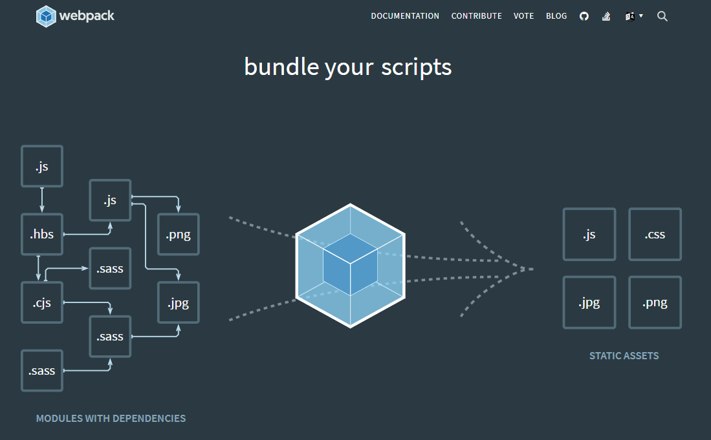
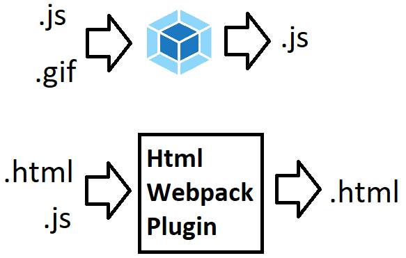
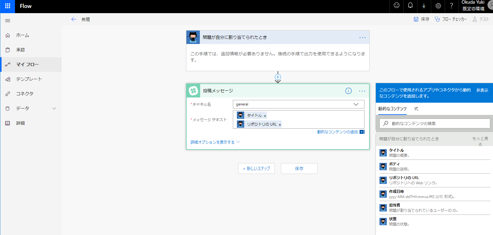
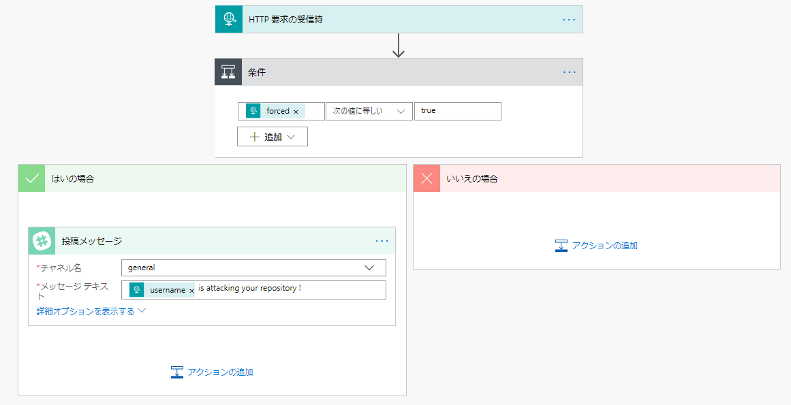
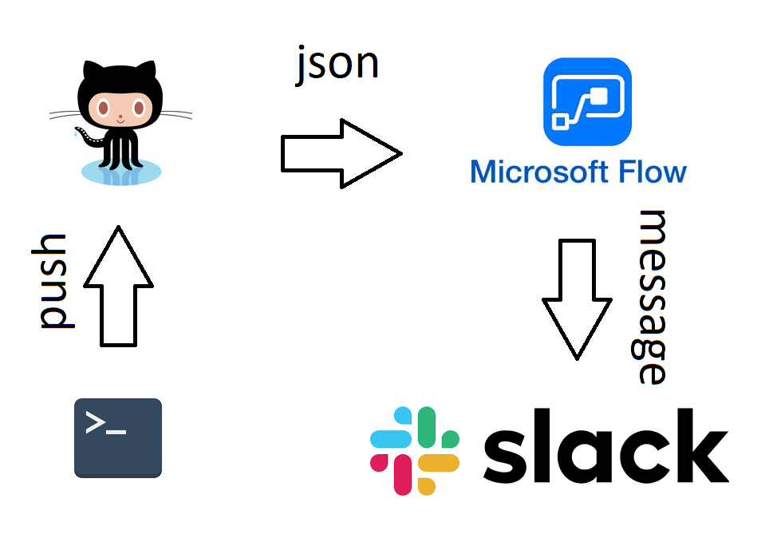
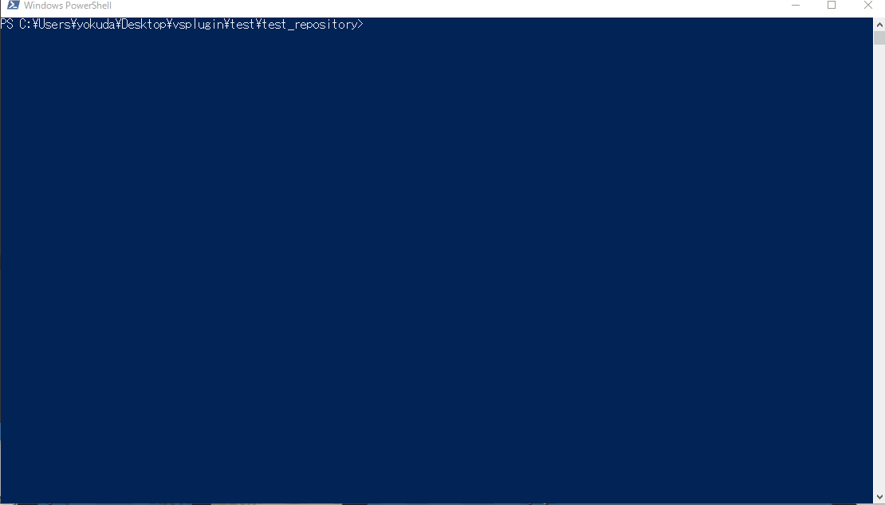

# VSCode Extension作ってみた

---

# VSCode Extensionとは
VSCodeにインストールできる拡張機能

---

# とりあえずHelloWorld

* コード生成
* コマンドの定義方法
* エントリーポイント
* デバッグ方法

---

# 作ってみた 1
## Tab keeper
タブ を保存 / 復活する

---

# Tab keeper
## 動かしてみる

---

# Tips
* resolve depnendencies : `npm install`
* packaging : `vsce package`
* add packages : `npm install --save-dev foobar`

---

# 作ってみた 2
## Git-Rocket
git push したときにGifアニメを表示する
---

# 動かした映像

---


---

# 実は・・・
## 画像は外部URLを参照している
## オフラインだと表示されない

---

# 改良してみた
## Git-Rocket

---

# 問題点
Extensionに画像データを含める方法が分からない

---

# 仕方ないので

これを使う

---

# Webpackとは
`JavaScript`を食べさせると、ファイル間依存のない一つの`JavaScript`を吐き出してくれる。

---



---

# Webpack
* `css`, `sass`
* `png`, `jpg`, `gif` など画像  

だいたいなんでも`JavaScript`にできる !

---

# webpackしたもの

* `rocket.html` : `js`を実行
* `rocket.js` : `gif`を`html`に表示
* `rocket.gif`

---

# こんな感じにwebpack


---

# htmlをTypeScriptから読む方法

index.html
```html
<!DOCTYPE html>
<html lang="en">
  <head>
    <meta charset="utf-8">
    <title>hello</title>
  </head>
  <body>
    <p>Hello</p>
  </body>
</html>
```
これを・・・

---

# こうする
index.ts
``` typescript
export const html=`
<!DOCTYPE html>
<html lang="en">
  <head>
    <meta charset="utf-8">
    <title>hello</title>
  </head>
  <body>
    <p>Hello</p>
  </body>
</html>
`;
```

---

これで画像データを含んだExtensionが作れる！

---

# 実際に動かしてみる

---

---

時間が余れば・・・
# MSFlow使ってみた

---

# MSFlowとは
正式名称 : Microsoft Flow  
簡単なフローをスケマティックに設計して  
実行可能なサービス

---



---

## コードにも組み込めます
* HTTP Requestで発火させられます！
* jsonでデータ渡せます！

---


---

# コード
Powershell
```powershell
Invoke-RestMethod 
-Uri "https://prod-18.japaneast.logic.azure.com:443/workflows/438ee4ce630b4a5186fc3b84b01ca467/triggers/manual/paths/invoke?api-version=2016-06-01&sp=%2Ftriggers%2Fmanual%2Frun&sv=1.0&sig=3r88D2FhPZDBicnb9QidtL-ejyqfSsTwqu3PCIN-4gc" 
-Method POST 
-Body ( @{"channel"="general";"message"="hello"} 
    | ConvertTo-Json) 
-ContentType 'application/json'
```

---

# 映像

---


---

# やってみた
Github push force 通知

---



---



---

# 映像

---



---

# 一緒に動かしてみた

---


---

# 以上

---

---

---

offline test  
uninstall extensions
